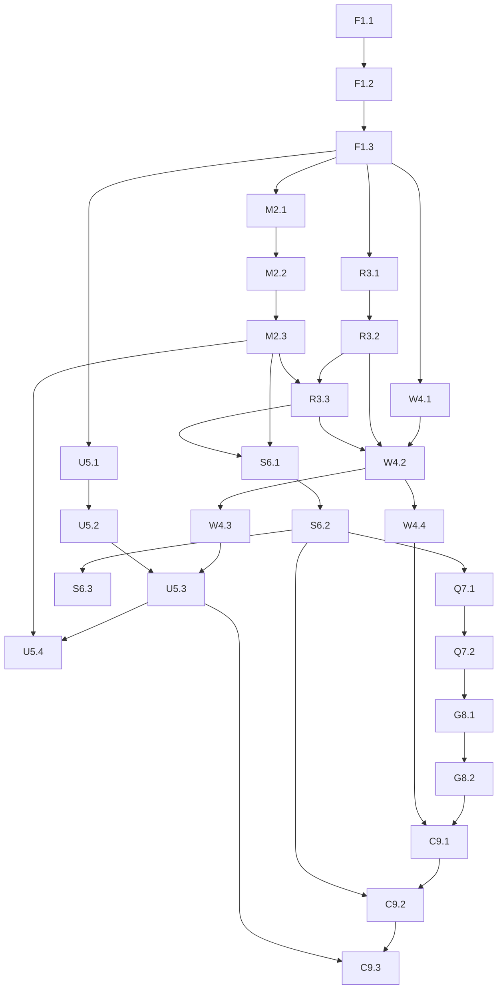

# PLAN: Street Arcade — Servidor Monolítico Backend + Frontend

> **Tipo de Projeto:** BACKEND + WEB (Monolito)
> **Stack:** Fastify · Redis Pub/Sub · MongoDB · UDP · WebSocket · Sessão · QR Code · Gamepad Web
> **Agentes Responsáveis:** `backend-specialist` · `frontend-specialist`

---

## 📌 Visão Geral

O Street Arcade é um sistema de controle de jogos via celular que usa QR Code para entrada na sessão e WebSocket para transmissão de inputs em tempo real ao Totem (Unity/C#). O servidor Node.js monolítico expõe WebSocket e REST via **Fastify**, persiste sessões no **MongoDB**, usa **Redis Pub/Sub** para broadcast interno de eventos, e entrega os inputs ao Totem via **UDP**.

```
Celular (Gamepad Web)
   └─ WebSocket ──► Fastify (Node.js Monolito)
                        ├─ MongoDB  (sessões)
                        ├─ Redis    (pub/sub + cache de sessão)
                        └─ UDP ────► Unity (Totem)
```

---

## ✅ Critérios de Sucesso

- [ ] Servidor Fastify inicializa com plugins WS, Redis, MongoDB e UDP em sequência controlada
- [ ] Sessão criada via API, armazenada no MongoDB e sincronizada no Redis
- [ ] Frontend obtém URL com sessionID via QR Code, valida sessão e abre Gamepad
- [ ] Input do Gamepad viaja via WebSocket → Redis → UDP → Totem com latência < 50 ms
- [ ] Reconexão automática de WebSocket funciona sem perda de sessão
- [ ] Heartbeat detecta clientes inativos e limpa sessão

---

## 🔧 Stack Tecnológico

| Camada | Tecnologia | Justificativa |
|---|---|---|
| Servidor HTTP/WS | **Fastify** | Alta performance, plugin ecosystem |
| Mensageria interna | **Redis Pub/Sub** | Desacopla WS ↔ UDP broadcaster |
| Cache de sessão | **Redis** (hash/TTL) | Acesso rápido, TTL automático |
| Persistência | **MongoDB** | Schema flexível para sessões/config |
| Baixa latência | **UDP (dgram)** | Fire-and-forget para inputs de jogo |
| Real-time client | **WebSocket** nativo (ws) | Suporte nativo via plugin Fastify |
| Frontend | **HTML + Vanilla JS** | Zero dependência, leve no celular |
| QR Code | **qrcode** (npm) | Geração server-side |
| Identidade | **UUID v4** | SessionID, PlayerID |

---

## 📁 Estrutura de Diretórios

```
db-street-arcade-backend/
├── src/
│   ├── app.js
│   ├── server.js
│   ├── config/
│   │   └── env.js
│   ├── plugins/
│   │   ├── redis.js
│   │   ├── mongodb.js
│   │   ├── websocket.js
│   │   └── udp.js
│   ├── modules/
│   │   ├── session/
│   │   │   ├── session.routes.js
│   │   │   ├── session.service.js
│   │   │   └── session.repository.js
│   │   └── game/
│   │       ├── game.routes.js
│   │       └── game.handler.js
│   └── lib/
│       ├── logger.js
│       └── qrcode.js
├── public/
│   ├── index.html
│   ├── play.html
│   ├── css/
│   │   ├── base.css
│   │   └── gamepad.css
│   └── js/
│       ├── qrcode-page.js
│       ├── session.js
│       ├── websocket-client.js
│       └── gamepad.js
├── .env.example
└── package.json
```

---

## 🗺️ Ordem de Desenvolvimento (Integração Incremental)

```
FASE 1: Fundação Fastify
    └─► FASE 2: MongoDB (persistência de sessão)
            └─► FASE 3: Redis (cache + Pub/Sub)
                    └─► FASE 4: WebSocket (comunicação real-time)
                            └─► FASE 5: UDP (gateway para Unity)
                                    └─► FASE 6: Controle de Sessão (completo)
                                            └─► FASE 7: Frontend QR Code
                                                    └─► FASE 8: Frontend Gamepad + WS Client
                                                            └─► FASE 9: Sessão JS (end-to-end)
```

---

## 📋 Breakdown de Tarefas

### ⚡ FASE 1 — Fastify Base

> **Agente:** `backend-specialist` | **Skill:** `nodejs-best-practices`

#### TASK-F1.1 — Setup do Projeto
- **INPUT:** Diretório vazio
- **OUTPUT:** `package.json`, `.env.example`, estrutura de pastas, Fastify na porta 3000
- **VERIFY:** `curl http://localhost:3000/health` retorna `{ "status": "ok" }`

#### TASK-F1.2 — Configuração de Ambiente
- **OUTPUT:** `src/config/env.js` com variáveis validadas (PORT, MONGO_URI, REDIS_URL, UDP_HOST, UDP_PORT)
- **VERIFY:** Servidor recusa inicialização se variável obrigatória estiver ausente
- **Dependencies:** F1.1

#### TASK-F1.3 — Logger + Sistema de Inicialização
- **OUTPUT:** `src/lib/logger.js` (pino), `src/server.js` com inicialização ordenada de plugins
- **VERIFY:** Logs estruturados em JSON aparecem no console ao subir
- **Dependencies:** F1.2

---

### 🍃 FASE 2 — MongoDB

> **Agente:** `backend-specialist` | **Skill:** `database-design`

#### TASK-M2.1 — Plugin MongoDB
- **OUTPUT:** `src/plugins/mongodb.js` — conecta, decora `fastify.mongo`
- **VERIFY:** Log confirma conexão ao subir
- **Dependencies:** F1.3

#### TASK-M2.2 — Schema de Sessão
- **OUTPUT:** Definição de documento sessions + TTL index

```js
{
  _id: "uuid-v4",
  status: "waiting|active|finished",
  totems: [{ id, ip, udpPort }],
  players: [{ id, connectedAt }],
  maxPlayers: 2,
  createdAt: Date,
  expiresAt: Date
}
```

- **VERIFY:** TTL index criado na collection
- **Dependencies:** M2.1

#### TASK-M2.3 — Session Repository
- **OUTPUT:** `session.repository.js` com `createSession`, `findById`, `addPlayer`, `updateStatus`, `deleteSession`
- **VERIFY:** Operações testadas via script de seed
- **Dependencies:** M2.2

---

### 🔴 FASE 3 — Redis (Cache + Pub/Sub)

> **Agente:** `backend-specialist` | **Skill:** `nodejs-best-practices`

#### TASK-R3.1 — Plugin Redis
- **OUTPUT:** `src/plugins/redis.js` — duas conexões: `redisPublisher` e `redisSubscriber`
- **VERIFY:** `fastify.redisPublisher.ping()` retorna `PONG`

> ⚠️ Pub/Sub exige conexões separadas — subscriber não pode enviar comandos normais.

#### TASK-R3.2 — Padrão de Canais

```
game:input:{sessionId}     → inputs do jogador
game:event:{sessionId}     → eventos do servidor
session:sync:{sessionId}   → sincronização de estado
```

Formato de mensagem:
```js
{ type, sessionId, playerId, data: { action, state }, ts }
```

- **Dependencies:** R3.1

#### TASK-R3.3 — Sincronização Sessão → Redis
- **OUTPUT:** Sessão sincronizada no Redis como HASH com TTL
- **VERIFY:** `redis.hgetall("session:{id}")` retorna dados após criação
- **Dependencies:** R3.2, M2.3

---

### 🔌 FASE 4 — WebSocket

> **Agente:** `backend-specialist` | **Skill:** `nodejs-best-practices`

#### TASK-W4.1 — Plugin WebSocket
- **OUTPUT:** Registra `@fastify/websocket`
- **VERIFY:** `wscat -c ws://localhost:3000/ws/game` conecta sem erro

#### TASK-W4.2 — Handler de Conexão
- **INPUT:** Conexão WS com `?sessionId=X&playerId=Y`
- **OUTPUT:** Valida sessão, mapeia `socket → { sessionId, playerId }`, publica `player_connected`
- **Dependencies:** W4.1, R3.3

#### TASK-W4.3 — Handler de Mensagem (Input)
- **INPUT:** Mensagem `{ action, state }`
- **OUTPUT:** Publica no Redis `game:input:{sessionId}`
- **VERIFY:** `redis-cli subscribe game:input:TEST` recebe mensagem ao pressionar botão
- **Dependencies:** W4.2, R3.2

#### TASK-W4.4 — Handler de Desconexão + Heartbeat
- **OUTPUT:** Remove player no close, heartbeat ping/pong (timeout: 30s)
- **VERIFY:** Desconexão limpa player após 30s
- **Dependencies:** W4.2

---

### 📡 FASE 5 — UDP Gateway

> **Agente:** `backend-specialist` | **Skill:** `nodejs-best-practices`

#### TASK-U5.1 — Módulo UDP Sender
- **OUTPUT:** `src/plugins/udp.js` — socket `dgram`, expõe `fastify.udpSend(ip, port, message)`
- **VERIFY:** Pacote capturável por `nc -ulp 9001`
- **Dependencies:** F1.3

#### TASK-U5.2 — Formato de Pacote UDP

```js
// JSON compacto < 512 bytes
{
  sid: "8chars",   // primeiros 8 chars sessionId
  pid: "8chars",
  a:   "btn_A",    // action abreviada
  s:   1,          // 1=pressed, 0=released
  ts:  1710000     // timestamp truncado
}
```

- **Dependencies:** U5.1

#### TASK-U5.3 — Subscriber Redis → UDP Dispatcher
- **OUTPUT:** Subscriber converte mensagem Redis → pacote UDP → Totem mapeado
- **VERIFY:** Input WS chega como UDP em `nc -ulp 9001`
- **Dependencies:** U5.2, W4.3, R3.2

#### TASK-U5.4 — Mapa Sessão → IP do Totem
- **OUTPUT:** `game.handler.js` roteia pacotes por `session.totems[0].ip`
- **VERIFY:** Dois totems recebem apenas pacotes da sua sessão
- **Dependencies:** U5.3, M2.3

---

### 🎮 FASE 6 — Controle de Sessão

> **Agente:** `backend-specialist` | **Skill:** `nodejs-best-practices`

#### TASK-S6.1 — Session Service
- **OUTPUT:** `session.service.js` com `createSession`, `joinSession`, `leaveSession`, `endSession`
- **VERIFY:** Fluxo testado via curl: criar → entrar → sair → encerrar
- **Dependencies:** M2.3, R3.3

#### TASK-S6.2 — Session Routes (REST API)

```
POST   /api/sessions
GET    /api/sessions/:id
POST   /api/sessions/:id/join
DELETE /api/sessions/:id
GET    /api/sessions/:id/qr
```

- **VERIFY:** Status HTTP corretos (200/201/400/404)
- **Dependencies:** S6.1

#### TASK-S6.3 — Sistema de Timeout
- **OUTPUT:** Timeout via `SESSION_TIMEOUT_MS` no `.env`, reset por input, cleanup ao expirar
- **VERIFY:** Sessão expira sem input, log confirma cleanup
- **Dependencies:** S6.1, R3.3

---

### 📱 FASE 7 — Frontend: QR Code

> **Agente:** `frontend-specialist` | **Skill:** `frontend-design`

#### TASK-Q7.1 — Página de Entrada
- **OUTPUT:** `public/index.html` + `qrcode-page.js` — exibe QR Code da sessão
- **VERIFY:** QR Code escaneado abre `/play/{sessionId}` corretamente
- **Dependencies:** S6.2

#### TASK-Q7.2 — Rota de Jogo no Fastify
- **OUTPUT:** `GET /play/:sessionId` serve `play.html` com sessionId injetado
- **VERIFY:** Página exibe sessionId correto
- **Dependencies:** Q7.1

---

### 🕹️ FASE 8 — Frontend: Gamepad

> **Agente:** `frontend-specialist` | **Skill:** `frontend-design`

#### TASK-G8.1 — Layout Base do Gamepad
- **OUTPUT:** D-Pad + 4 botões (A/B/X/Y) + indicador de status + feedback visual
- **VERIFY:** Layout correto em 375px/390px, sem scroll
- **Dependencies:** Q7.2

#### TASK-G8.2 — Touch Events + Eventos de Input
- **OUTPUT:** `gamepad.js` — `touchstart/touchend`, multi-touch, previne scroll/zoom
- **VERIFY:** DevTools mostra eventos ao tocar botões
- **Dependencies:** G8.1

---

### 🌐 FASE 9 — WebSocket Client + Sessão JS

> **Agente:** `frontend-specialist` | **Skill:** `frontend-design`

#### TASK-C9.1 — WebSocket Client
- **OUTPUT:** `websocket-client.js` — fila de envio, reconexão exponencial (1s→30s), heartbeat 15s
- **VERIFY:** Religar Wi-Fi reconecta sem recarregar a página
- **Dependencies:** W4.4, G8.2

#### TASK-C9.2 — Sessão JS
- **OUTPUT:** `session.js` — lê sessionId da URL, gera playerId (sessionStorage), valida sessão, estados visuais
- **VERIFY:** sessionId inválido → erro; válido → Gamepad visível
- **Dependencies:** C9.1, S6.2

#### TASK-C9.3 — Integração Final End-to-End
- **OUTPUT:** Pipeline: Botão → WS → Redis → UDP → Totem
- **VERIFY:**
  - `nc -ulp 9001` recebe pacotes ao pressionar botões
  - Latência WS→Redis→UDP < 20ms em rede local
  - Sessões isoladas — celulares diferentes não interferem
- **Dependencies:** C9.2, U5.3

---

## 📊 Diagrama de Dependências



---

## 🗓️ Milestones

| Milestone | Fases | O que funciona |
|-----------|-------|----------------|
| **M1 — Servidor Base** | F1+M2+R3 | HTTP + MongoDB + Redis operacionais |
| **M2 — Real-time Core** | +W4 | WS aceita conexões, inputs no Redis |
| **M3 — Gateway UDP** | +U5 | Pacotes chegam no `nc` listener |
| **M4 — Sessão Completa** | +S6 | CRUD com timeout e player join/leave |
| **M5 — Frontend QR** | +Q7 | Celular acessa `/play/:sessionId` via QR |
| **M6 — MVP Completo** | +G8+C9 | Celular controla Totem fim-a-fim |

---

## ⚠️ Riscos e Mitigações

| Risco | Prob. | Mitigação |
|-------|-------|-----------|
| Redis subscriber antes do WS | Alta | Ordem no `app.js`: Redis → Mongo → WS → Routes |
| TTL Redis expirar antes de Mongo | Média | TTL Redis = TTL Mongo - 60s |
| Multi-touch no iOS Safari | Alta | `touchstart/end` + `preventDefault` explícito |
| Perda de pacotes UDP | Baixa | Fire-and-forget aceitável; retry para eventos críticos |
| Memory leak nos sockets WS | Média | `Map<socket, player>` com cleanup no `close` |

---

## 🔍 PHASE X — Verificação Final

```bash
npx eslint src/ public/js/
python .agent/skills/vulnerability-scanner/scripts/security_scan.py .
python .agent/skills/frontend-design/scripts/ux_audit.py .
python .agent/skills/webapp-testing/scripts/playwright_runner.py http://localhost:3000 --screenshot
```

### Checklist Manual

- [ ] Nenhuma variável hardcoded no código
- [ ] `SESSION_TIMEOUT_MS` configurável via `.env`
- [ ] Gamepad funciona no iOS Safari
- [ ] Desconexão de um celular não afeta outros
- [ ] `nc -ulp 9001` recebe inputs corretamente
- [ ] QR Code gerado abre URL correta

---

*Plano gerado em:* 2026-04-07 | *Versão:* 1.0
